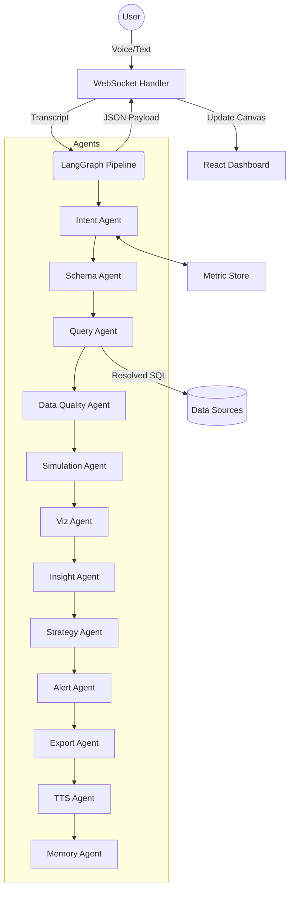

# 🎙️ Talking BI — Enterprise Agentic Business Intelligence

**A powerful, voice-first BI platform.** Transform natural language into production-ready dashboards with a multi-agent LangGraph pipeline. Query any data source, pick the perfect visualization, and receive AI-driven insights — all via voice or text.

---

## 🚀 Enterprise Features

*   **🗣️ Voice-Driven Analytics:** Speak or type natural language to generate professional charts instantly. Powered by **Whisper** and **Groq (Llama 3.3 70B)**.
*   **📏 Semantic / Metric Store:** Define business metrics (MRR, CAGR, Churn) once in Python. The `QueryAgent` resolves semantic names to canonical SQL automatically.
*   **🛡️ Data Quality & Hygiene:** Every chart includes a **Data Quality Badge** profiling null percentages, outliers, and freshness (powered by `DataQualityAgent`).
*   **🚨 Proactive Alerts:** Anomaly detection built into the pipeline. Insights that exceed thresholds trigger **Slack** or **Webhook** alerts automatically.
*   **🖨️ Stakeholder Exports:** Generate high-fidelity **PDF** or **Excel** reports directly from dashboard panels with AI-narrated executive summaries.
*   **📊 Automated Executive Dashboards:** Dynamically generate advanced, multi-panel layouts from uploaded datasets, utilizing multi-select clarifying questions to tailor precisely to user context.
*   **🧠 LangGraph Orchestration:** A fault-tolerant 12-agent pipeline with per-node retries and graceful degradation.
*   **🔗 Unified Data Connectors:** Query across **PostgreSQL**, **MySQL**, **CSV/Excel** (via DuckDB), **Power BI**, **Salesforce**, and **Shopify**.
*   **💾 Persistent Vector Memory:** ChromaDB-backed session recall allows complex multi-turn discovery (e.g., *"Now show the breakdown by region for that"*).

---

## 🏗️ Architecture

Talking BI utilizes a sophisticated **LangGraph** orchestration pipeline that streams real-time updates via WebSockets.



| Phase | Agent | Responsible For |
|---|---|---|
| **Parse** | `IntentAgent` | Converts transcript to structured JSON with Few-Shot & CoT grounding. |
| **Logic** | `MetricStore` | Resolves natural language metrics (e.g. "churn") to canonical SQL expressions. |
| **Context** | `SchemaAgent` | Retrieves metadata via TTL-based cache with relevance filtering. |
| **Execute** | `QueryAgent` | Generates safe SQL with automatic `LIMIT` and `EXPLAIN` cost-checks. |
| **Hygene** | `DataQuality` | Profiles results for nulls, outliers, and freshness; generates quality badges. |
| **Model** | `Simulation` | Performs predictive what-if analysis and business scenario modeling. |
| **Visualize**| `VizAgent` | Selects best chart (Recharts/ECharts) and validates data shape. |
| **Analyze** | `InsightAgent`| Narrates data, flags anomalies, and suggests follow-up queries. |
| **Prescribe**| `Strategy` | Generates ranked prescriptive recommendations and next steps. |
| **Notify** | `AlertAgent` | Dispatches alerts via Slack/Webhooks if anomalies exceed thresholds. |
| **Export** | `ExportAgent` | Generates high-fidelity PDF/Excel reports from dashboard state. |
| **Retain** | `MemoryAgent` | Persists session context via ChromaDB for semantic recall. |

---

## ⚡ Quickstart

### Prerequisites
*   **System**: Python 3.11+ | Node.js 20+ | Redis (optional)
*   **API Keys**: A [Groq API Key](https://console.groq.com) is **required**.

### 1. Backend Setup
```bash
cd backend
cp .env.example .env
# Set your GROQ_API_KEY and SECRET_KEY in .env
pip install -r requirements.txt
python main.py
```
*Backend runs on: `http://localhost:8000`*

### 2. Frontend Setup
```bash
cd frontend
npm install
npm run dev
```
*Frontend runs on: `http://localhost:3000`*

---

## 🛡️ Enterprise Reliability

*   **Adaptive Rate Limiting & Fallbacks:** Built-in resilient LLM routing with automated backoff for `429 Too Many Requests` and dynamic model fallbacks, ensuring uninterrupted high-volume dashboard generation.
*   **Robust SQL Auto-Correction:** Advanced query syntax validation enforcing strict DuckDB-compliant rules with auto-retry loops to resolve binder errors and eliminate generative hallucinations on the fly.
*   **Fault Tolerance:** Every agent node is wrapped in a `try-except` fallback. Non-critical failures (Insight, Strategy, TTS) allow the pipeline to proceed with a successful query result.
*   **Query Safety:** Enforced `10,000` row limit, `30s` execution timeout, and read-only SQL validation via `EXPLAIN` cost estimation.
*   **Schema Caching:** TTL-based cache with MD5 checksums prevents redundant database introspection on 100+ table schemas.
*   **WebSocket Heartbeat:** Backend sends periodic `agent_thinking` pings during long-running tasks to prevent client timeouts and provide real-time status.

---

## 📁 Project Structure

```text
talking-bi/
├── backend/
│   ├── agents/           # LangGraph agents (Intent, MetricStore, Quality, etc.)
│   ├── core/             # Auth, Config, DB, Redis, Vector Memory (Chroma)
│   ├── api/              # FastAPI routes (Auth, Export, KPIs) + WS handler
│   └── main.py           # Application entry point
├── frontend/
│   ├── src/
│   │   ├── components/   # DashboardCanvas, ChartRenderer, MetricBrowser
│   │   ├── stores/       # Zustand State (biStore, authStore, metricStore)
│   │   └── hooks/        # useWebSocket, useVoiceRecorder
│   └── vite.config.ts
├── docker-compose.yml
└── README.md
```

---

## 🔌 Data Connectors

| Source | Configuration (`backend/.env`) |
|---|---|
| **SQL DB** | `ANALYTICS_DB_URL=postgresql+asyncpg://...` or `mysql+aiomysql://...` |
| **CSV/Excel** | Drop in the "Files" sidebar — *Zero config required (powered by DuckDB)*. |
| **Power BI** | `POWERBI_CLIENT_ID`, `POWERBI_CLIENT_SECRET`, `POWERBI_TENANT_ID` |
| **Shopify** | `SHOPIFY_SHOP_URL`, `SHOPIFY_ACCESS_TOKEN` |
| **Salesforce** | `SALESFORCE_USERNAME`, `SALESFORCE_PASSWORD`, `SALESFORCE_SECURITY_TOKEN` |

---

## 🗣️ Command Capabilities

The system handles both direct queries and context-aware follow-ups:

- **Direct:** *"Top 5 customers by revenue"*
- **Comparison:** *"Sales this year vs last year"*
- **Trend:** *"What's our weekly unit growth?"*
- **Follow-up:** *"Now filter that for the Electronics category"*
- **Drill-down:** *"Show the breakdown by region for that"*

---

## 📡 WebSocket Protocol

Communication happens in real-time via the `/ws/{session_id}` endpoint.

**Client → Server:**
- `{ type: "text_query", query: "..." }`
- `{ type: "voice_audio", audio: "base64_webm" }`

**Server → Client:**
- `{ type: "agent_thinking", stage: "intent", message: "Analyzing..." }`
- `{ type: "agent_result", data: { chart, insights, sql, ... } }`
- `{ type: "error", message: "..." }`

---

## 🔧 Deployment & Infrastructure

### Docker Compose
```bash
# Set your GROQ_API_KEY in the root .env
docker-compose up --build
```

### Components
- **Frontend:** Vite + React + Zustand + Recharts + TailwindCSS
- **Backend:** FastAPI + LangGraph + Groq + OpenAI Whisper (Voice)
- **Data:** SQLAlchemy (SQL) + DuckDB (Files)
- **Caching:** Redis (Optional, defaults to in-memory)

---

## 🛠️ Extending the Platform

### Adding a New Agent
1. Create `agents/your_agent.py` implementing an `async run()` method.
2. Register the node in `agents/orchestrator.py`'s `StateGraph`.
3. Link with edges to the desired pipeline flow.

### Custom KPI Registration
Define business logic once and let the agents reuse it:
```bash
curl -X POST http://localhost:8000/api/v1/kpis \
  -H "Content-Type: application/json" \
  -d '{
    "name": "mrr_growth",
    "display_name": "MRR Growth Rate",
    "sql_expression": "100.0 * (SUM(mrr) - LAG(SUM(mrr))) / LAG(SUM(mrr))",
    "unit": "percentage",
    "direction": "up_good"
  }'
```

---

## 🔒 Security
- **SELECT-Only Guard:** All agent-generated SQL is validated against an allow-list before execution.
- **Environment Driven:** All secrets are kept out of the codebase via `.env` management.
- **CORS Restricted:** Explicit origin allow-listing for production safety.

---

