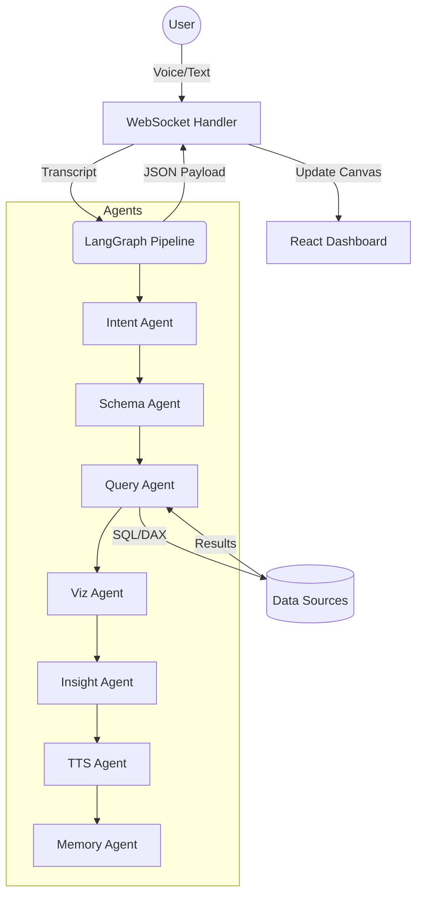

# 🎙️ Talking BI — Enterprise Agentic Business Intelligence

**A powerful, voice-first BI platform.** Transform natural language into production-ready dashboards with a multi-agent LangGraph pipeline. Query any data source, pick the perfect visualization, and receive AI-driven insights — all via voice or text.

---

## 🚀 Key Features

*   **🗣️ Voice-Driven Analytics:** Speak or type natural language to generate professional charts instantly. Powered by **OpenAI Whisper** and **Groq (Llama 3.3 70B)**.
*   **🧠 LangGraph Orchestration:** A sophisticated 7-agent pipeline (Intent → Schema → Query → Viz → Insight → TTS → Memory) that handles the entire analytics lifecycle.
*   **🖼️ Multi-Page Canvas:** An enterprise-grade, Power BI-inspired dashboard architecture with responsive canvas layouts, KPI strips, and pinned visualizations.
*   **🔗 Unified Data Connectors:** Query across **PostgreSQL**, **MySQL**, **CSV/Excel** (via DuckDB), **Power BI**, **Salesforce**, and **Shopify** without writing a single line of SQL or DAX.
*   **💡 Agentic Insights:** Every chart comes with an automated "So What" analysis, identifying trends, anomalies, and performing ranked root-cause analysis.
*   **💾 Conversational Memory:** Follow up on previous queries with context-aware filtering (e.g., *"Now filter that to North region"*).

---

## ⚡ Quickstart

### Prerequisites
*   **System**: Python 3.11+ | Node.js 20+ | Redis (optional)
*   **API Keys**: A [Groq API Key](https://console.groq.com) is **required**.

### 1. Backend Setup
```bash
cd backend
cp .env.example .env
# Set your GROQ_API_KEY in .env
pip install -r requirements.txt
python main.py
```
*Backend runs on: `http://localhost:8000`*

### 2. Frontend Setup
```bash
cd frontend
npm install
npm run dev
```
*Frontend runs on: `http://localhost:3000`*

### 3. Open & Explore
Visit `http://localhost:3000` and try asking:
- *"Show me revenue by product this year"*
- *"Compare sales this month vs last month"*
- *"What's our customer churn trend?"*

> **Note:** Works immediately with **built-in demo data**; no database connection required for the first run!

---

## 🏗️ Architecture

Talking BI utilizes a sophisticated **LangGraph** orchestration pipeline that streams real-time updates via WebSockets.



| Phase | Agent | Responsible For |
|---|---|---|
| **Parse** | `IntentAgent` | Converts transcript to structured JSON (type, metrics, dimensions, filters). |
| **Context** | `SchemaAgent` | Retrieves relevant table/file metadata to ground the LLM's world-view. |
| **Execute** | `QueryAgent` | Generates and runs optimal SQL/DAX against target data sources. |
| **Visualize** | `VizAgent` | Selects the best chart type (Recharts) and builds the configuration object. |
| **Analyze** | `InsightAgent` | Performs anomaly detection and generates ranked natural language insights. |
| **Narrate** | `TTSAgent` | Synthesizes a spoken summary for voice-first interactions. |
| **Retain** | `MemoryAgent` | Persists session context for multi-turn follow-up queries. |

---

## 📁 Project Structure

```text
talking-bi/
├── backend/
│   ├── agents/           # LangGraph agents (Intent, Query, Viz, etc.)
│   ├── core/             # Config, DB connections, Redis client
│   ├── api/              # FastAPI routes + WebSocket handler
│   └── main.py           # Entry point
├── frontend/
│   ├── src/
│   │   ├── components/   # DashboardCanvas, ChartRenderer, VoiceBar
│   │   ├── stores/       # Zustand State (biStore)
│   │   └── hooks/        # useWebSocket, useVoiceRecorder
│   └── vite.config.ts
├── docker-compose.yml
└── README.md
```

---

## 🔌 Data Connectors

| Source | Configuration (`backend/.env`) |
|---|---|
| **SQL DB** | `ANALYTICS_DB_URL=postgresql+asyncpg://...` or `mysql+aiomysql://...` |
| **CSV/Excel** | Drop in the "Files" sidebar — *Zero config required (powered by DuckDB)*. |
| **Power BI** | `POWERBI_CLIENT_ID`, `POWERBI_CLIENT_SECRET`, `POWERBI_TENANT_ID` |
| **Shopify** | `SHOPIFY_SHOP_URL`, `SHOPIFY_ACCESS_TOKEN` |
| **Salesforce** | `SALESFORCE_USERNAME`, `SALESFORCE_PASSWORD`, `SALESFORCE_SECURITY_TOKEN` |

---

## 🗣️ Command Capabilities

The system handles both direct queries and context-aware follow-ups:

- **Direct:** *"Top 5 customers by revenue"*
- **Comparison:** *"Sales this year vs last year"*
- **Trend:** *"What's our weekly unit growth?"*
- **Follow-up:** *"Now filter that for the Electronics category"*
- **Drill-down:** *"Show the breakdown by region for that"*

---

## 📡 WebSocket Protocol

Communication happens in real-time via the `/ws/{session_id}` endpoint.

**Client → Server:**
- `{ type: "text_query", query: "..." }`
- `{ type: "voice_audio", audio: "base64_webm" }`

**Server → Client:**
- `{ type: "agent_thinking", stage: "intent", message: "Analyzing..." }`
- `{ type: "agent_result", data: { chart, insights, sql, ... } }`
- `{ type: "error", message: "..." }`

---

## 🔧 Deployment & Infrastructure

### Docker Compose
```bash
# Set your GROQ_API_KEY in the root .env
docker-compose up --build
```

### Components
- **Frontend:** Vite + React + Zustand + Recharts + TailwindCSS
- **Backend:** FastAPI + LangGraph + Groq + OpenAI Whisper (Voice)
- **Data:** SQLAlchemy (SQL) + DuckDB (Files)
- **Caching:** Redis (Optional, defaults to in-memory)

---

## 🛠️ Extending the Platform

### Adding a New Agent
1. Create `agents/your_agent.py` implementing an `async run()` method.
2. Register the node in `agents/orchestrator.py`'s `StateGraph`.
3. Link with edges to the desired pipeline flow.

### Custom KPI Registration
Define business logic once and let the agents reuse it:
```bash
curl -X POST http://localhost:8000/api/v1/kpis \
  -H "Content-Type: application/json" \
  -d '{
    "name": "mrr_growth",
    "display_name": "MRR Growth Rate",
    "sql_expression": "100.0 * (SUM(mrr) - LAG(SUM(mrr))) / LAG(SUM(mrr))",
    "unit": "percentage",
    "direction": "up_good"
  }'
```

---

## 🔒 Security
- **SELECT-Only Guard:** All agent-generated SQL is validated against an allow-list before execution.
- **Environment Driven:** All secrets are kept out of the codebase via `.env` management.
- **CORS Restricted:** Explicit origin allow-listing for production safety.

---

